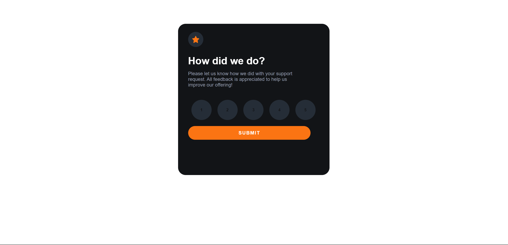
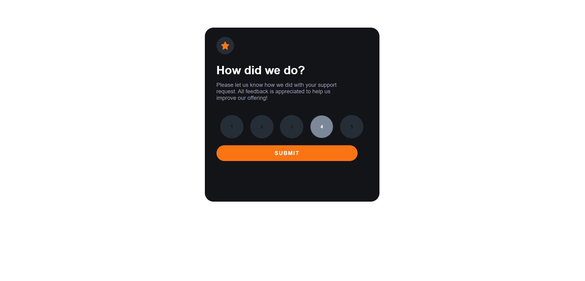
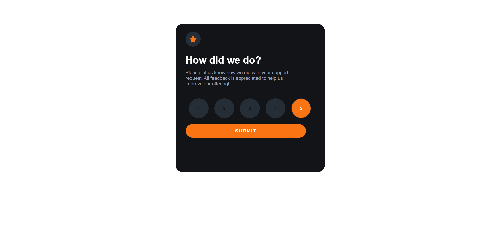
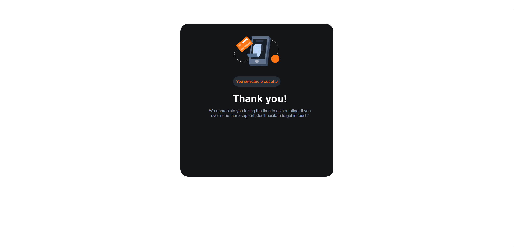
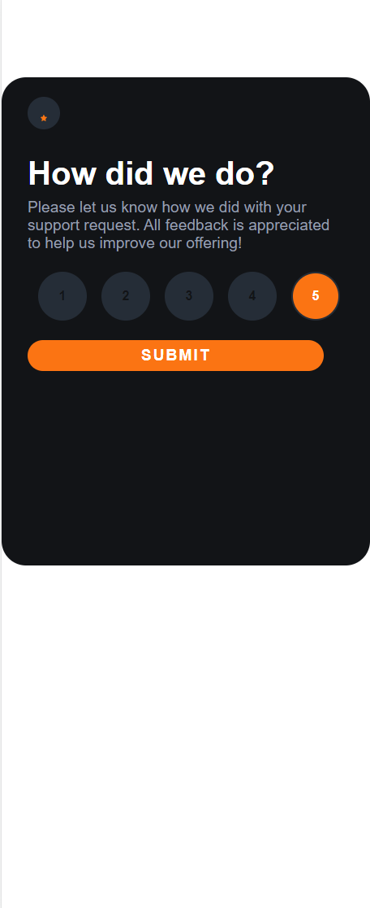

# Interactive Rating Component

This is a solution to the Interactive Rating Component Challenge provided by Frontend Mentor. The component is built with React and allows users to select and submit a rating out of 5. Upon submission, the user receives a thank you message and sees the rating they have given.

## Overview

### Challenge Details

Users should be able to:

- View the optimal layout for the app depending on their device's screen size
- See hover states for all interactive elements on the page
- Select and submit a number rating
- See the "Thank you" card state after submitting a rating

## The Process

### Screenshots

#### Desktop






#### Mobile



### Built With

- Semantic HTML5 markup
- CSS custom properties
- Flexbox
- React JS
- Mobile-first workflow

### Learnings

Through this project, I was able to deepen my understanding of React and state management. I learned how to conditionally render components based on state changes. I also practiced styling a form and handling form submission in a React component.

Here's an example of the conditional rendering that I used in this project:

```js
if(submitted){
    return (
        <div className="App">
            <div className="thank-you-container">
                ...
            </div>
        </div>
    );
}

